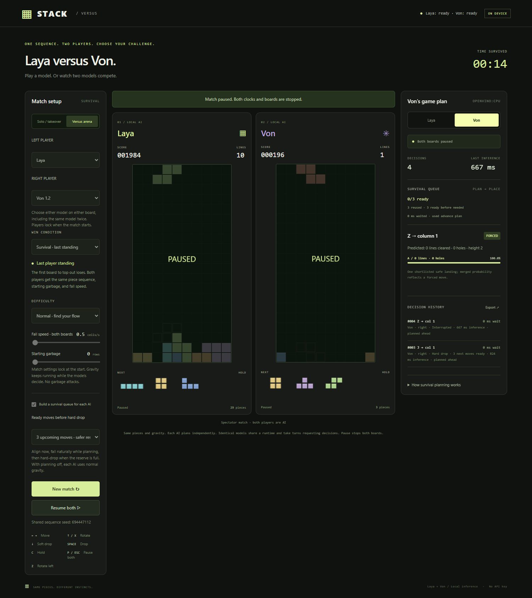

# STACK / Local AI Tetris Lab

Local Tetris with manual play, mid-game AI takeover, selectable Laya or Von, difficulty presets, adjustable gravity (0.5–20 cells/second), level progression, starting garbage, hold, ghost landing, next pieces, pause, and an inspectable decision panel.




## Install from a fresh clone (Windows)

Install **Node.js 20+ with npm** (24 LTS recommended), **Python 3.12**, and Git. This version has been tested on Windows with 16 GB RAM. The two models download about 5 GB of weights; allow additional space for Python packages and runtime caches. Internet is needed for setup, then gameplay runs locally without an API key.

```powershell
git clone https://github.com/jaredjlg2/local-ai-tetris.git
cd local-ai-tetris
powershell -ExecutionPolicy Bypass -File .\setup.ps1
powershell -ExecutionPolicy Bypass -File .\start.ps1
```

Open **http://127.0.0.1:8776/** for solo or **http://127.0.0.1:8776/versus** for human/model matches. Keep the server terminal open. Wait for the selected models to report ready; first-time loading and runtime compilation can take a few minutes. Subsequent starts only need `npm start` or `start.ps1`.

Setup installs the locked Node dependencies, downloads and verifies Laya with a sample inference, creates an isolated `.venv-von` environment, installs Von's locked Python dependencies, and downloads its pinned weights. Model weights, environments, and caches are intentionally excluded from GitHub; the setup scripts recreate them. No files from a parent workspace or Codex installation are required.

Manual setup, if preferred:

```powershell
npm ci
npm run setup:laya
powershell -ExecutionPolicy Bypass -File .\setup-von.ps1
npm start
```

**Other platforms:** the JavaScript and Python service paths support Unix layouts, but the full model setup has only been validated on Windows. Use `python3 -m venv .venv-von`, install `von-requirements.lock.txt` with that environment's Python, and run `setup-von.py`; choose `cpu` in `von-runtime-config.json` if OpenVINO is unavailable. Hardware acceleration support and Python wheels vary by platform.

## What's included

- Solo manual play and AI takeover with adjustable difficulty and fall speed.
- Human, Laya, or Von on either board, including model-versus-model matches.
- Survival, line race, score race, and timed score attack.
- Independent planning queues, per-player decision panels, and JSON exports.
- Source code, dependency lockfiles, model downloaders, launchers, tests, and GitHub Actions unit checks.

## Run checks

```powershell
npm test
```

The 27 unit tests run without downloaded models or a running server. Live/browser tests require setup to be complete and the game server running. Windows browser tests use installed Microsoft Edge by default:

```powershell
npm run test:browser
npm run test:duel
```

Playwright is included as a development dependency. On other platforms, install its Chromium build with `npx playwright install chromium`. Set `PLAYWRIGHT_CHANNEL` to select an installed browser, or `PLAYWRIGHT_PATH` to use an alternate Playwright installation. Generated screenshots and reports go into ignored `test-results/`.

## Choose Laya or Von

Use **Local AI model** in solo, or **Left player / Right player** in the versus arena. Both models support solo takeover and all four multiplayer win conditions. Solo saves the model choice in this browser; versus initially uses it as the right player. Each request specifies its model, so another tab's selection cannot switch your opponent. In solo, changing models returns control to you, discards queued plans, and preserves your board. In versus, both players are locked for the match. The side panel, history, results, and exports identify the model that actually made each decision.

## Model versus model

On `/versus`, select **Human**, **Laya**, or **Von** independently for each board. This supports Human vs either model (on either side), Laya vs Von, Von vs Laya, Laya vs Laya, and Von vs Von, with any win condition. AI-only matches are spectator games: gameplay keys cannot move either AI board. Human controls automatically follow the human board; if both players are human, the control selector chooses which board receives inputs.

Each AI has its own decision pipeline, predicted boards, reserve, and history. Use the two buttons above the decision panel to inspect either side. Pause stops both boards and invalidates pending plans. Identical models share one loaded runtime and submit requests through a FIFO queue, so one board cannot repeatedly jump ahead of the other's queued request. Different models may infer concurrently; all matches still share this PC's compute, so these are gameplay comparisons rather than isolated model benchmarks. Same-frame AI target finishes are judged together and can draw.

Exports contain a `players` array with each side's controller and statistics, a `left`/`right`/`draw` winner, and decisions tagged by side and actual model. This also distinguishes the two players when the same model is selected twice. `node tests/duel-browser.mjs` checks all four AI pairings with actual local inference, independent queues and panels, pause, results across the four win conditions, exports, human input on either side, and mobile layout.

Both models receive the same Tetris state, shortlist, and survival instructions through `decision.js`. Both use the same two/three-move reserve, reachability checks, and natural-gravity rules. A sole shortlisted move is explicitly labeled forced; the original probabilities are retained in exports. No substitute heuristic is presented as either model.

Laya uses the existing local ONNX runtime. **Von 1.2** uses the official `von-sdk==1.2.3` in `.venv-von`, through a private stdin/stdout Python process. Its weights, calibration, and tokenizer are pinned to Hugging Face revision `5df8185a4f2327ad0a7cd117cc4f701ac557b9ae` in `models/von-1.2` (about 3.16 GB including the SDK's two weight files). Runtime network access is disabled for Von. No API key or paid service is used.

To reinstall Von on Windows with Python 3.12, run `powershell -ExecutionPolicy Bypass -File .\setup-von.ps1`, then restart the normal Tetris launcher. Dependencies are pinned in `von-requirements.lock.txt`. `von-runtime-config.json` chooses its device. The tested Intel GPU path returned non-finite probabilities on Tetris inputs, so it is not the default; Von uses OpenVINO CPU, with PyTorch CPU fallback if loading or warm-up fails. Startup checks actual Tetris prompts with different option counts before declaring readiness. The header reports the runtime actually loaded. Laya's GPU configuration is separate and unchanged.

Official Von sources: [repository and Apache-2.0 license](https://github.com/wfzyx/von), [model card](https://huggingface.co/wfzyx/von). Published speed claims depend on hardware and workload; use the game's inference timing or `node tests/models-check.mjs` for this PC. That check compares identical positions and validates responses, but is not a playing-strength benchmark.

This PC's initial comparison used 16 identical Tetris states, alternating model order and excluding the first two states from timing. Laya averaged **464 ms** (median 478 ms), Von **516 ms** (median 552 ms) across 14 measured states. They selected the same landing on 11 of 16 states; agreement is not an accuracy measure. Both passed valid-choice/probability checks and the forced-single-landing case. Details are saved in `test-results/model-comparison.json`. The working Von configuration was slightly slower in this sample.

`node tests/model-browser.mjs` checks actual Von solo autoplay and all four versus modes, switching during an outstanding Laya request, model locking, persistent selection, winner/export identity, and switching back to actual Laya. It uses near-finish fixtures to exercise match results after observing real autoplay.

## Human versus AI

Open http://127.0.0.1:8776/versus or choose **Versus arena** from the control room. This is a local, two-board match on the same PC. Select Human on your preferred side and either model on the other. Use the normal keyboard controls or the buttons beneath the boards. Select a win condition before starting:

- **Survival:** last player standing (default).
- **Line race:** first to clear 20, 40, or 100 lines. Clearing past the target also wins.
- **Score race:** first to 5,000, 10,000, or 25,000 points. Line clears and drop points both count.
- **Score attack:** highest score after 2, 3, or 5 minutes. The countdown pauses with the match; equal final scores draw.

In every mode, topping out loses immediately, even if that move reaches a target. Simultaneous top-outs draw. If both players reach a race target on the same gravity tick, the match is a draw. The progress strip shows race targets or live scores; results explain the winning condition. These modes keep Laya's existing survival-first placement strategy and queued planning.

Both players receive independent copies of the same seeded seven-bag sequence and identical starting garbage. Fall speed is shared and stays fixed for the match; difficulty and garbage settings lock at the start. Gravity runs continuously for both boards, including while Laya is deciding. There are no garbage attacks. The first player to top out loses; simultaneous top-outs in the same gravity tick produce a draw. P or Escape pauses/resumes both boards and the shared clock. Switching tabs also pauses the match. A model error pauses the entire match rather than handing Laya's board to the human. New match generates a new shared seed.

The decision panel shows the inspected player's live choices, probabilities, predicted board effects, inference time, actual waiting time, and advance-planning status. Export saves the mode, target or time limit, result and reason, seed, pipeline counters, and up to 500 decisions per side. Matches run locally; there is no online matchmaking.

## Survival queue and placement timing

**Build a survival queue** is enabled by default in solo and versus modes. Laya chooses and aligns the current placement early, then uses the piece's normal fall time to build a reserve of **three upcoming decisions**, configurable to two. Each future decision uses the predicted board produced by the preceding placement, including line clears. One inference runs at a time; the queue never exceeds the selected depth.

The controller permits hard drop or accelerated downward steps **only when the full reserve is ready**. Sideways movement and rotation happen immediately so the piece is positioned safely while inference continues. Gravity keeps running; a piece can naturally land and lock before the reserve fills. When that natural placement matches the predicted board, its queued successors are retained. With advance planning disabled, Laya uses normal gravity without automatic hard drops.

Before consuming a prepared result, the planner compares the actual board, piece type, and turn serial to the prediction. The controller verifies the target remains reachable from the current falling position. A mismatch invalidates all dependent plans. Pause, reset, hold/handoff, and depth changes also invalidate old work. The reserve is replenished after each move, using newly visible preview pieces. A failed speculative request is retried when needed.

The panel shows **ready/target** plus the queued piece types. Decision history records how many upcoming moves were ready at each hard drop, or whether normal gravity placed the piece. **Last inference** remains actual model time; **wait** measures time spent waiting when the current decision was needed, not reserve-building time. A full queue is a conditional plan, not a guarantee of survival. Very fast gravity can still outrun inference or movement.

## Server and runtime configuration

The server binds to `127.0.0.1` only. Set the `PORT` environment variable before `npm start` to change port 8776 (live test scripts assume the default). The browser has no external font or asset dependencies.

`runtime-config.json` controls Laya's ONNX execution providers; unsupported GPU initialization falls back to CPU. `von-runtime-config.json` controls Von, with CPU fallback if its configured runtime fails warm-up. The two model runtimes load separately and report their readiness in the app. See the hardware notes below before changing acceleration settings.

## Play

- Start playing manually, or click **Laya** to start under model control.
- Switch **Manual / Laya** at any point. Escape takes back control immediately.
- Left/right move, up or X rotates clockwise, Z rotates counterclockwise, down soft-drops, space hard-drops, C holds, P pauses.
- Speed changes apply immediately. Presets also select starting garbage, which applies on the next new game.
- Normal gravity is the default. Solo offers an optional pause for the current decision only; building the future reserve never freezes gravity. Expired or unreachable decisions are discarded, never applied to a different piece. Pausing, resetting, or switching control invalidates in-flight decisions.
- The pacing slider sets the minimum wait after an AI placement before requesting the next decision; normal gravity still runs during that interval.
- Changing tabs pauses play. Keyboard shortcuts do not change the game while editing a settings control. Mobile layouts include game buttons.
- Export downloads up to 500 recent decisions, including the actual model answer and alternatives.

## What Laya actually does

The shared game engine enumerates reachable landings, simulates line clears, and evaluates holes, stack height, and unevenness. When the next piece is known, it excludes placements that block that piece's spawn whenever a survivable alternative exists. It prefers stack heights below 14 rows when possible, then minimizes holes and removes strictly dominated outcomes, shortlisting up to six. **The local Laya model makes the final choice** within that shortlist. If only one shortlisted safe placement remains, equivalent options satisfy the ONNX graph's two-option requirement and the UI explicitly labels a forced move. Inferior moves are no longer added merely to create a second option. The worker preserves raw model outputs in the export.

The UI shows genuine Laya option probabilities, observed inference latency, selected landing, calculated board effects, and execution status. It does not claim to show internal reasoning. Laya is a decision model, not a text generator. This is an assisted candidate-selection demonstration, not raw pixel control or a Tetris-trained policy. Strong play is not guaranteed. On model failure the game returns to manual mode with the error visible; no substitute bot is labeled Laya.

Gameplay uses seven-bag piece generation and simple horizontal rotation kicks, immediate lock on a failed gravity step, and classic line-clear scoring. It is not an exact implementation of the modern Tetris Guideline (no SRS/T-spin scoring or lock delay).

## Model and licensing

- Model: [Convai Innovations Laya](https://huggingface.co/convaiinnovations/laya), Apache 2.0.
- ONNX bundle: [receptron/laya-onnx](https://huggingface.co/receptron/laya-onnx).
- Runtime: [@receptron/laya](https://github.com/receptron/laya), MIT, pinned to 0.1.2 in package-lock.json.
- Local bundle: `models/receptron--laya-onnx/main/` (ignored by Git).

## Checks

`node --test tests/*.test.js` checks line clears/scoring, collision/top-out, seven-bag/hold, and that every proposed move has a legal execution path matching its predicted board effects.

`node setup-model.js` downloads the bundle if necessary and makes a real inference. `GET /api/status` reports readiness; `POST /api/decide` accepts `{board, active}` and returns the real decision, probabilities, candidates, and latency. Malformed states are rejected. Only one inference runs at a time.

With the server running, `node tests/inference-check.mjs` performs a deterministic 40-piece run using actual local Laya decisions. On this PC the seed-42 check completed 40 placements, cleared 13 lines, scored 3,012, and averaged 522 ms per request. This is one assisted-play check, not a model benchmark. The detailed report is in `test-results/live-inference.json`.

`node tests/browser-check.mjs` checks manual controls, autoplay, pause/resume, handoff during inference, export, reset, live gravity, and the mobile viewport in Edge. It uses the Playwright development dependency; set `PLAYWRIGHT_PATH` for an alternate installation.

`node tests/versus-browser.mjs` checks the real-model survival match, advance-plan reuse, human inputs, shared pause/clock, top-out/winner behavior, match export, restart, and mobile layout. The unit suite additionally tests line-clear prediction, stale-board rejection, hold/pause/reset invalidation, speculative-error retry, identical independent piece bags, shared gravity, and win/draw outcomes.

`node tests/modes-browser.mjs` uses near-finish board/score fixtures in an isolated browser to verify race wins, countdown expiry and pause, mode/target locking, restart, exports, and mobile layout. The unit suite covers actual line clears across a target, simultaneous race finishes, score awards, exact timer boundaries, and top-out precedence in all modes.

The survival browser check deliberately withholds the third future answer: it verifies the AI does not hard-drop with only two ready, and that its piece continues falling under normal gravity. It then releases that answer and checks that every recorded accelerated placement had the full three-move reserve. Unit tests cover the two-move setting, natural-lock reuse, next-spawn protection, and reserve refill beyond the original preview window.

## GPU acceleration

The default runtime now uses the Intel Arc GPU through ONNX Runtime WebGPU, with CPU support for operations that need it. Model weights remain FP32; the prompt, candidate selection, and scoring are unchanged. Typical game inputs are warmed before the header reports readiness. The header and Laya settings show the active device. If GPU initialization or warm-up fails, the worker loads the original FP32 CPU model with automatic thread allocation and visibly reports CPU fallback. Inference errors during a game still return control to the player.

Configuration lives in `runtime-config.json`. To use CPU exclusively, set `executionProviders` to `["cpu"]` and `sessionOptions.intraOpNumThreads` to `0` (automatic core count), then restart. The chosen GPU configuration retains four CPU support threads; testing eight CPU-only threads gave only a modest improvement, and one GPU support thread was slower. DirectML was tested but rejected because this model export failed during inference on it.

Same-input validation on this PC compared 48 positions twice: original four-thread CPU averaged 482 ms and GPU + CPU averaged 402 ms (17% lower latency). All 96 selected moves matched. The largest probability difference was 0.0003 (0.03 percentage points), consistent with different floating-point implementations. This verifies the sampled positions, not every possible board. No quantization, shorter prompt, or smaller model is used. Timing varies with other workloads, power/thermal conditions, and first-use GPU compilation.

`node tests/benchmark-runtime.mjs cpu4` and `node tests/benchmark-runtime.mjs webgpu` run isolated runtime comparisons against identical saved inputs. Stop the game server first to avoid memory/compute contention. For the larger check, set `BENCH_EXTENDED=1`, `BENCH_ROUNDS=2`, and `BENCH_SUFFIX=-validation`. Reports are saved in `test-results/performance/`. Restart the game afterwards with `start.ps1`.
